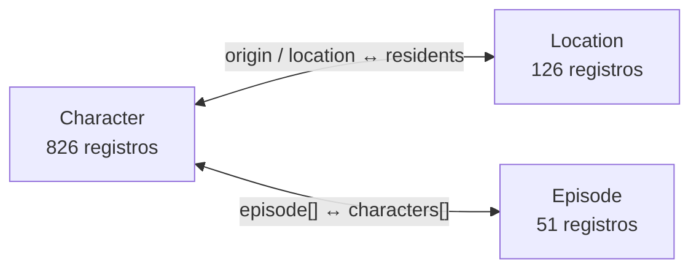

# Multiverso R&M — Brainstorming de Design

## Contexto e objetivo

Site de exploração do universo Rick and Morty, construído sobre a Rick and Morty API pública. A visualização em grafo é a peça central do site — a navegação acontece através dela, não em torno dela. Objetivo: uma experiência visualmente distinta, fugindo dos clichês que hoje denunciam um site gerado por IA.

O produto é um instrumento de exploração científica de um multiverso caótico, não um site de fã de Rick and Morty.

## Modelo de dados

Character é o único elo entre Location e Episode.

Três recursos simples, com referências cruzadas que dão estrutura ao grafo:

- **Character**: id, name, status, species, type, gender, origin, location, image, episode[], url, created
- **Location**: id, name, type, dimension, residents[], url, created
- **Episode**: id, name, air_date, episode (ex: S01E01), characters[], url, created

Todas as referências entre recursos são URLs, não objetos embutidos — resolvidas em lote via `/character/1,2,3`. Filtros disponíveis: character (name, status, species, type, gender), location (name, type, dimension), episode (name, episode).

## Modelo de relações

O grafo possui três tipos principais de entidade: **Character**, **Location** e **Episode**. E três relações:

- Character → Location
- Character → Episode
- Episode → Character

A relação Character ↔ Episode representa a participação do personagem no episódio. A relação Character ↔ Location representa dois significados: **origin** e **location atual**.

Essas relações têm significados diferentes e não devem ser visualmente indistinguíveis. A visualização comunica claramente qual tipo de relação está sendo explorada.

## Estado inicial

O primeiro estado comunica imediatamente:

- que a aplicação é um grafo;
- o que representa um nó;
- que o grafo pode ser explorado;
- como iniciar uma exploração;
- quais dimensões de contexto estão disponíveis.

O estado inicial é compreensível e explorável sem conhecimento prévio da estrutura da Rick and Morty API. A primeira interação é descoberta naturalmente, sem tutorial obrigatório — por meio de hover, densidade, clusters, preview de residents ou outras formas de descoberta, sem transformar tudo em cards.

## Filtros

Baseado na distribuição real dos dados (826 characters, 126 locations, 51 episodes):

**Primários (sempre visíveis)**

- **Status** — Alive (453) / Dead (298) / unknown (89): central pro tom da série, toggle de 3 estados
- **Temporada** — S01 a S05 (~10 episódios cada): dimensão temporal do grafo, detalhada abaixo
- **Dimensão** — 34 dimensões distintas, concentradas: Replacement Dimension (57), unknown (29), Dimension C-137 (5), resto é cauda longa de 1-3. Filtro mais temático (multiverso), mas exige busca/autocomplete em vez de lista de checkbox por causa da cauda longa

**Temporada como dimensão temporal**

As temporadas formam um eixo explorável S01 → S02 → S03 → S04 → S05, não uma coleção de controles independentes. O modelo de interação preserva três comportamentos:

- **Seleção de contexto** — selecionar/desselecionar temporadas define quais dados participam da visualização
- **Exploração temporal** — ampliar ou reduzir o intervalo de temporadas mostra como o universo evolui, sem perder o contexto do grafo
- **Comparação** — selecionar temporadas, inclusive não contíguas (ex: S01 e S05), evidencia personagens e relações compartilhados entre esses períodos

O mecanismo de UI (timeline, range, seleção múltipla, controle híbrido ou outro) será definido depois, a partir desses comportamentos e dos princípios Graph First, Progressive Disclosure e Context Is Persistent.

**Secundários (painel avançado)**

- **Species** — 10 categorias, dominadas por Human (353) e Alien (231); as 4 menores cabem agrupadas em "outras"
- **Gender** — Male (620) / Female (153) / Genderless (17) / unknown (50)
- **Location type** — Planet, Cluster, Microverse, Resort, Dream, Fantasy town, TV, Space station: relevante só ao explorar a camada de locations

Status, dimensão, species, gender e location type são **filtros semânticos**: desenfatizam os elementos que não correspondem. Temporada é um **filtro estrutural/contextual**: altera quais dados e relações participam da exploração. Os filtros se combinam por AND; a busca por nome fica sempre disponível, independente dos filtros ativos.

Preferir desenfatizar antes de remover quando preservar o contexto for importante. Remover ou excluir da simulação quando a presença do elemento comprometer a legibilidade ou a performance.

## Interação

Quatro conceitos separados, cada um com uma função:

- **Filtro semântico** — desenfatiza elementos que não correspondem
- **Filtro estrutural/contextual** — altera quais relações estão sendo exploradas
- **Busca** — navega até uma entidade
- **Seleção** — muda o foco

| Interação | Natureza | Comportamento |
| --- | --- | --- |
| Hover | Transitória | Preview; não altera permanentemente o estado do grafo |
| Seleção | Persistente | Mantém a vizinhança destacada; abre informações e contexto; pode ser desfeita |
| Busca | Navegação | Localiza, centraliza e seleciona; não cria um estado completamente diferente |

## Abordagem de visualização

Grafo force-directed com disclosure progressivo. Nós iniciais são as 126 locations (dimensionadas pelo número de residents); clicar ou buscar um character expande a location e revela os characters como satélites ao redor dela.

Renderização em canvas (não SVG) — acima de ~200–300 nós em SVG o navegador engasga, e o grafo completo pode chegar a centenas de nós expandidos. Busca por nome usa zoom/pan até o nó encontrado, destacando as arestas conectadas.

O nível de detalhe depende do zoom e do contexto:

| Zoom | O que aparece |
| --- | --- |
| Muito afastado | Estruturas, agrupamentos e relações principais |
| Intermediário | Entidades |
| Próximo | Nomes, detalhes e relações específicas |

## Princípios de design

O grafo é o elemento central — a interface é construída ao redor da exploração das relações entre entidades, não como uma dashboard que contém um grafo. Qualquer elemento visual que compita desnecessariamente com ele deve ser questionado.

A experiência é de descoberta progressiva de um universo, não de consulta de registros. Busca e filtros são mecanismos de navegação e descoberta, não apenas ferramentas de consulta.

O caos pertence ao universo representado no grafo — a interface ao redor dele dá ordem através de hierarquia, agrupamento, contraste, filtros, seleção, contexto e estados visuais consistentes.

Cor, tamanho, posição, agrupamento e espessura de relações têm função semântica (tipo de entidade, estado, relação, seleção, foco, filtro), nunca decoração — cada recurso visual responde a uma pergunta do usuário. Quantidade de cores fica controlada pra preservar hierarquia. Movimento explica mudanças de estado (expansão, conexão, seleção, filtragem, navegação, mudança de contexto) — nunca decorativo ou repetitivo.

O usuário nunca perde a orientação: onde está, qual entidade está selecionada, quais filtros estão ativos, quais relações estão sendo exibidas, o que está oculto, e como voltar ao contexto anterior.

A identidade visual dialoga com o universo Rick and Morty por conceitos — multiverso, exploração, ciência, dimensões, portais, caos, descoberta — sem clichês visuais da franquia (nada de página promocional ou coleção de referências) e sem defaults de IA (fundo quase-preto + neon único, creme + serifada + terracota, cards idênticos, eyebrows em caixa alta, setas decorativas, numeração ornamental). Esses elementos só entram com justificativa ligada ao produto — uma técnica não é proibida por ser comum.

Toda decisão visual tem função: sem gradiente, sombra, glassmorphism, badge, ícone ou animação que não sirva à compreensão. A pergunta é sempre "essa decisão melhora a compreensão ou a experiência?".

Em dúvida entre duas soluções, prioridade: 1) melhora compreensão, 2) preserva contexto, 3) reduz ruído, 4) reforça exploração, 5) mantém consistência, 6) tem relação com os dados, 7) tem justificativa clara.

> Não seja original por obrigação. Seja específico por necessidade.

## Direção estética

A identidade visual deve nascer da natureza do produto: uma ferramenta de exploração de um universo complexo, relacional e temporal.

O objetivo não é criar um "site de Rick and Morty", mas uma experiência que faça o usuário sentir que está investigando e navegando por um multiverso.

### Personalidade

A direção visual deve combinar:

- exploração;
- ciência;
- descoberta;
- complexidade;
- precisão;
- estranheza;
- escala;
- curiosidade.

A estética deve sugerir um instrumento de investigação de um fenômeno desconhecido, e não uma página promocional ou um fan site.

### Fontes de inspiração conceitual

Buscar referências em:

- visualização científica;
- cartografia;
- astronomia;
- instrumentos de observação;
- mapas de redes;
- interfaces experimentais;
- sistemas de informação;
- visualização de grandes estruturas relacionais.

Não utilizar essas referências para copiar estilos específicos. Utilizá-las para compreender linguagem, composição, hierarquia e tratamento da informação.

### Direção por elemento

| Elemento | Direção |
| --- | --- |
| Fundo | Profundo, espacial, mas não necessariamente preto |
| Grafo | Protagonista e altamente legível |
| Locations | Âncoras estruturais |
| Characters | Elementos secundários que orbitam |
| Episodes | Camada temporal |
| Seleção | Contraste forte e imediato |
| Relações | Discretas em repouso, evidentes em foco |
| Texto | Técnico, preciso, mas não corporativo |
| UI | Compacta e funcional |
| Decoração | Mínima |

### Gramática visual

A interface deve possuir uma linguagem visual consistente para representar:

- tipos de entidades;
- relações;
- importância;
- seleção;
- contexto temporal;
- estado dos filtros;
- foco;
- descoberta.

Sempre que possível, características visuais devem possuir significado. A linguagem do grafo funciona como um alfabeto visual:

| Recurso | Significado |
| --- | --- |
| Forma | Tipo de entidade |
| Tamanho | Peso / importância / quantidade |
| Posição | Relação espacial |
| Linha | Tipo de relacionamento |
| Cor | Categoria / estado |
| Opacidade | Relevância contextual |
| Movimento | Mudança de estado |

O usuário precisa olhar para o grafo e reconhecer o tipo de cada entidade sem depender de uma legenda:

- **Location** — forma maior e mais estável; representa um agrupamento; possui maior peso visual.
- **Character** — forma menor; orbita e se relaciona com Locations; possui identidade individual.
- **Episode** — outra linguagem visual; aparece principalmente quando o contexto temporal é explorado.

As relações também possuem gramática própria.

### Cor

| Papel | Tratamento |
| --- | --- |
| Background | Neutro profundo |
| Grafo | Tons neutros + uma escala de destaque |
| Location | Cor A |
| Character | Cor B |
| Episode | Cor C |
| Seleção | Contraste máximo |
| Filtrado / contextual | Redução de luminância / opacidade |

A paleta é validada sobre o grafo com os dados reais, não em amostras isoladas.

### Tipografia

A tipografia segue o papel do produto: científico + editorial + tecnológico, sem parecer uma landing page de startup.

- uma família principal extremamente legível;
- eventualmente uma segunda família para dados e metadados;
- números e códigos com tratamento próprio;
- nomes de entidades com bastante clareza.

Tipografia não deve tentar "parecer Rick and Morty".

### Identidade visual

A identidade não deve depender de referências literais à franquia. Evitar como elementos dominantes:

- portal verde;
- estética cartoon;
- fontes caricatas;
- olhos, alienígenas e referências explícitas a personagens;
- elementos decorativos retirados diretamente da série;
- UI cyberpunk genérica;
- neon sobre fundo preto;
- aparência de dashboard SaaS.

Rick and Morty deve estar presente principalmente através do conceito de multiverso, exploração, ciência, relações, dimensões e caos.

### Processo de definição

A direção visual não deve ser decidida a partir de uma única composição estática.

Devem ser exploradas pelo menos três direções visuais distintas, mantendo os mesmos princípios de interação e o mesmo modelo de dados.

Cada direção deve ser avaliada utilizando os mesmos estados:

1. grafo inicial;
2. expansão de uma Location;
3. seleção de um Character;
4. destaque de vizinhança;
5. busca;
6. filtragem;
7. exploração temporal;
8. comparação entre temporadas;
9. alta densidade de nós.

A direção escolhida deve manter clareza, identidade e hierarquia em todos esses estados.

### Regra

A estética não deve ser adicionada ao grafo.

**A estética deve nascer do próprio sistema de exploração.**

## Referências técnicas

As referências abaixo servem exclusivamente para estudar mecânicas de interação, comportamento e implementação. Não são referência de identidade visual, composição, tipografia ou estética — o produto desenvolve sua própria linguagem visual a partir dos princípios de design deste documento.

### Renderização — [Force-directed graph, canvas](https://observablehq.com/@d3/force-directed-graph-canvas/2)

Referência para renderização de grandes quantidades de nós em canvas, comportamento físico do grafo, atualização das posições, performance e interação direta com nós. A aparência visual da referência não é inspiração.

### Zoom e navegação — [Force-Directed Graph - Zoomable](https://observablehq.com/@rahulgawale/force-directed-graph-zoomable)

Referência para zoom, pan, navegação pelo espaço do grafo, transformação da viewport e comportamento durante a exploração. O zoom preserva a continuidade espacial: o usuário percebe que navega pelo mesmo universo, não que alterna entre telas.

### Destaque de vizinhança — [Force-Directed Graph with Link Highlighting](https://observablehq.com/@john-guerra/force-directed-graph-with-link-highlighting)

Referência para seleção de um nó, identificação e destaque de seus relacionamentos, redução visual do que não é relacionado e exploração de vizinhança. O destaque cria hierarquia clara entre:

1. entidade selecionada;
2. entidades diretamente relacionadas;
3. demais entidades.

### Filtragem — [Filtering d3-force nodes based on an input value](https://talk.observablehq.com/t/filtering-d3-force-directed-nodes-based-on-an-input-value/2120)

Referência para filtragem por nome, atualização do conjunto de nós, comportamento do grafo após a filtragem e estabilidade da interação. Filtros são mecanismos de exploração, não controles administrativos.

### Combinação de interações — [Drag / Zoom / Pan / Filter / Highlight](https://gist.github.com/fzyukio/19ea102d4cf3749ccabde8eaac0f7ca5)

Referência para estudar a combinação de drag, zoom, pan, filter e highlight. A implementação final garante que essas interações não entrem em conflito e que o usuário compreenda claramente cada estado.

### Fonte de dados — [Rick and Morty API](https://rickandmortyapi.com/)

Os dados reais da API influenciam a experiência visual: categorias, relacionamentos, quantidade de entidades e distribuição dos dados entram nas decisões de design.

### Regra de uso das referências

As referências técnicas não determinam a aparência do produto. O processo é **referência → comportamento → adaptação → linguagem própria**, nunca referência → cópia visual. Antes de adotar um comportamento de uma referência, avaliar:

- Qual problema de interação ele resolve?
- Como se encaixa no modelo mental do grafo?
- Preserva o contexto do usuário?
- Funciona com disclosure progressivo?
- Mantém a hierarquia visual definida pelos princípios de design?
- Existe uma maneira mais adequada ao produto?

A implementação final deve parecer uma experiência única de exploração do universo de Rick and Morty, ainda que use padrões técnicos conhecidos.
